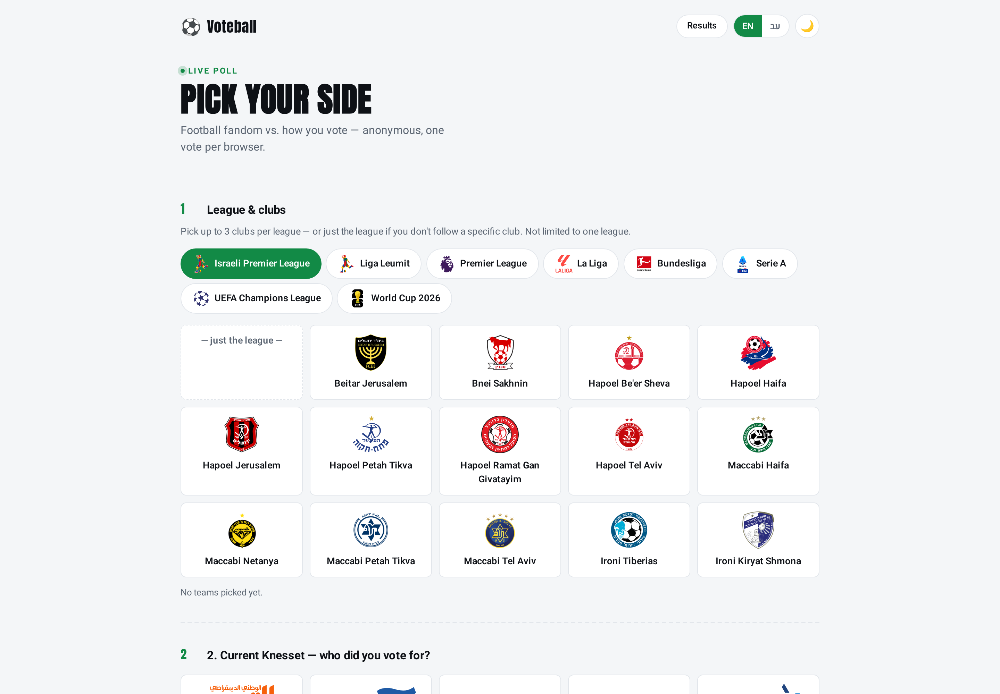
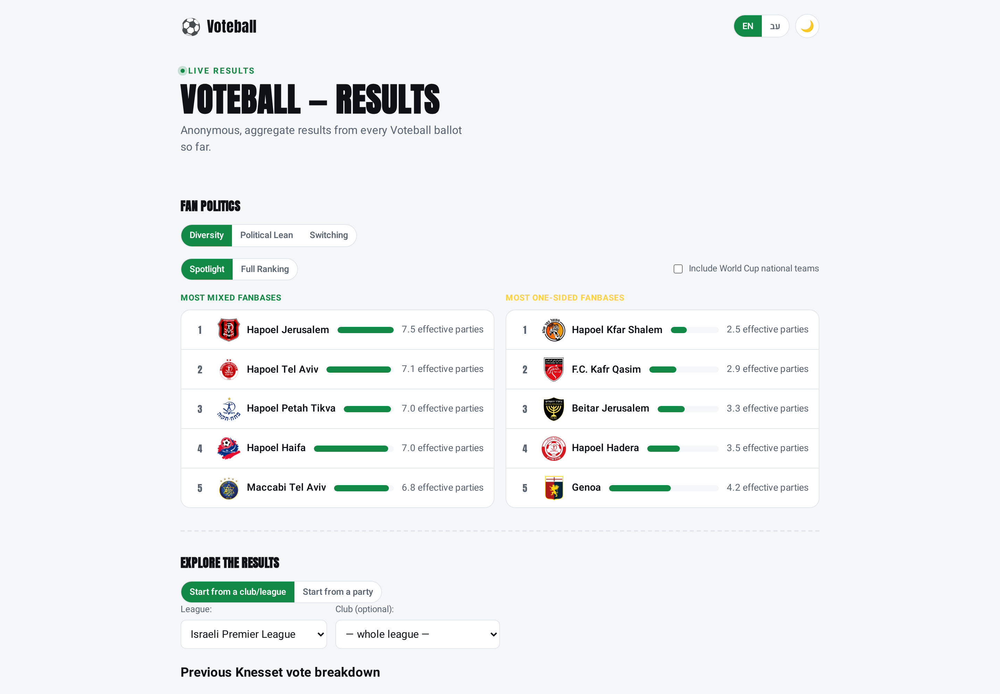
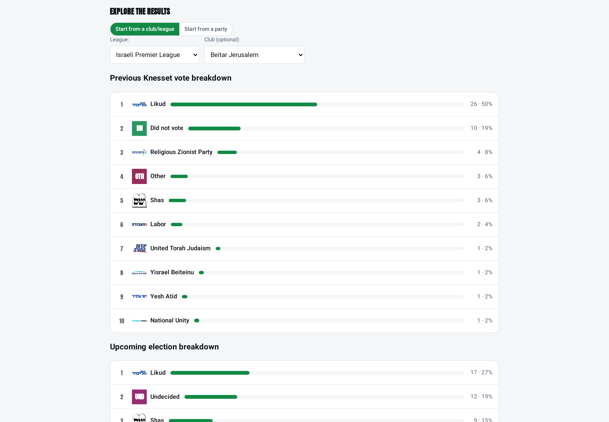
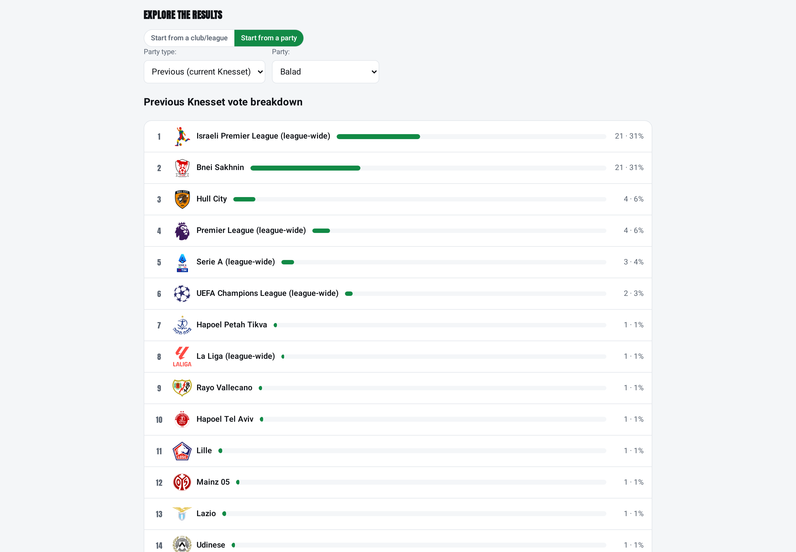
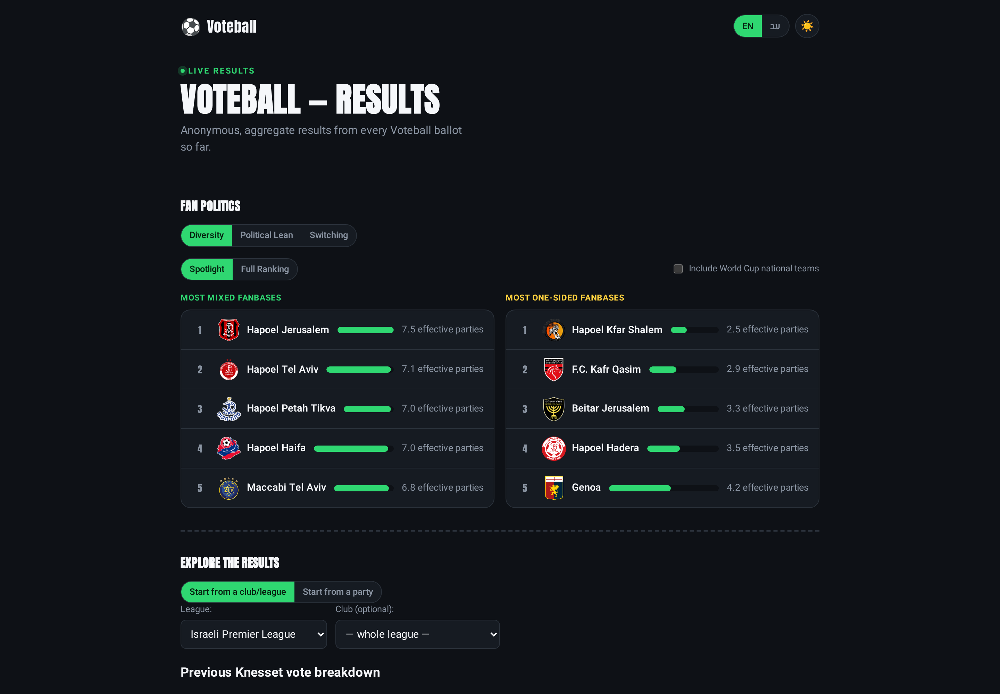
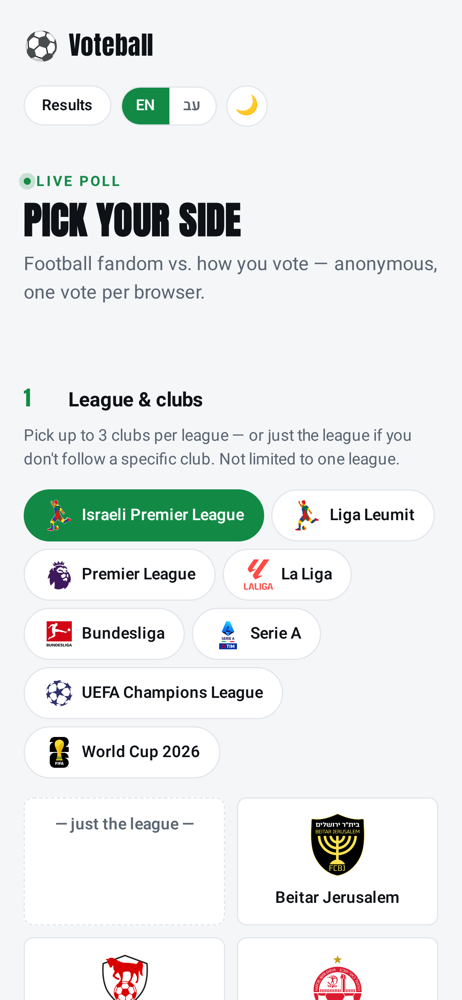

# Voteball

A public poll correlating **football fandom** with **Israeli political-party voting**, timed to the
run-up to the next Knesset election. Runs on **Amazon EKS**, deployed by two commands.

The repo is self-contained: fork it, put your own domain and AWS account in one file, and
`./scripts/deploy.sh` builds the whole stack — VPC, cluster, database, registry, certificate,
add-ons and the app. See the [Quickstart](#quickstart).

## Screenshots

> Captured from the app running locally against a seeded demo dataset (~660 ballots). The party
> leanings shown are **illustrative demo data**, not real survey results.

**Casting a ballot** — pick up to 3 clubs per league, across any number of leagues:



**The results dashboard** opens on fan-base analytics — which clubs draw politically mixed crowds and
which are one-sided, measured in "effective parties":



**The actual point of the poll** — start from a club and see how its fans voted. Beitar Jerusalem's
fanbase leans heavily Likud:



**Or run it backwards** — start from a party and see which clubs its voters follow. Balad's voters
are concentrated in Bnei Sakhnin, the mirror image of the Beitar result:



**Dark mode and mobile** — party logos are recoloured for dark backgrounds:

| Dark mode | Mobile |
|---|---|
|  |  |

## How the poll works

A visitor casts one ballot with three parts:

1. **Your teams** — pick the football club(s) you support: up to 3 specific clubs per league, across any
   number of leagues (or just "this league, no specific club").
2. **Last election** — did you vote, and for which party?
3. **Next election** — who are you considering (up to 3 parties), or undecided?

The **results dashboard** then correlates the two: which parties a club's fans lean toward, how support
splits by league, national totals, and analytics tabs (fan-base **diversity**, **political-lean**, and
**vote-switch** between the last and next election). One vote per visitor (cookie-deduped).

## How it's built

Three containers, plus managed AWS services:

- **frontend** — nginx serving a static voting form + results dashboard (plain HTML/CSS/vanilla JS, no
  build step), proxying `/api/*` to the backend.
- **backend** — Flask/gunicorn API for voting, results, and admin, backed by **RDS** Postgres.
- **worker** — recomputes results rollups on a loop and sends **SNS** milestone alerts as totals cross
  thresholds; snapshots results to **S3**.

It runs on **EKS** in a dedicated VPC: an **ALB Ingress** (HTTPS via **ACM**) fronts the app; secrets
come from **Secrets Manager** via External Secrets Operator; images live in **ECR**; delivery is **GitOps**
(ArgoCD) fed by a **GitHub Actions** pipeline (build → Trivy scan → ECR → auto-sync); monitoring is
Prometheus/Grafana + CloudWatch.

## Quickstart

Running this creates real, billed AWS resources (**≈$200/month** while up). Tear it down when you're
done — `./scripts/destroy.sh` takes a final database snapshot, so nothing is lost.

**You need:** `terraform`, `aws` (logged in), `kubectl`, `helm`, `docker`, `python3`, `openssl`, and a
**Route53 public hosted zone you already own** (the stack looks it up; it never creates one).

**1. Configure — this is the only file with your identity in it:**

```bash
cd terraform
cp voteball.tfvars.example voteball.tfvars
```

Set four values in it: `app_domain`, `route53_zone_name`, `db_password`, `notification_email`.
Everything else has a working default.

**2. Deploy:**

```bash
./scripts/deploy.sh          # asks you to confirm before Terraform creates anything billed
```

It resolves the newest DB snapshot (or starts with an empty database), applies Terraform, prompts for
your admin credentials and seeds them into Secrets Manager, builds and pushes the four images, fills in
`charts/voteball/values.yaml` from Terraform outputs, installs the chart, and hands ongoing delivery to
ArgoCD. Then confirm the SNS subscription email AWS sends you, and open `https://<your app_domain>`.

**3. Tear down:**

```bash
./scripts/destroy.sh
```

### Notes for forkers

- **Never hand-edit the `FILLED-BY-SYNC` values in `charts/voteball/values.yaml`.** The database
  endpoint, certificate ARN, registry, bucket and IAM roles are all regenerated whenever the stack is
  rebuilt; `./scripts/sync-values-from-tf.sh` writes them, and `--check` fails if they drift.
- **Secrets never enter git.** Terraform creates an empty Secrets Manager container and ignores its
  contents; `./scripts/seed-eks-secret.sh` populates it from your environment or a silent prompt, and
  External Secrets Operator syncs it into the cluster.
- **For CI** (optional), set three GitHub repo variables: `AWS_ROLE_ARN` (from
  `terraform output github_actions_role_arn`), `AWS_REGION`, and `ECR_REGISTRY` (from
  `terraform output ecr_registry`). Add `CLUSTER_NAME` too if you changed it from `voteball`.
- **Costs.** The EKS control plane, NAT gateway, ALB and RDS dominate the bill. Node capacity is Spot.
- **Empty results page?** A fresh deploy has no votes. `./scripts/seed-demo-votes.py 500 https://<your
  app_domain>` posts demo ballots through the public API so the dashboard has something to show (the
  screenshots above were made this way). The worker computes the rollups within ~30s.

### Running it locally, without AWS

The whole app runs on Docker alone — useful for development, and it exercises the same schema
bootstrap a fresh RDS instance gets:

```bash
docker network create vb-net
docker run -d --name vb-db --network vb-net -e POSTGRES_PASSWORD=demo postgres:17
docker build -t voteball-backend services/backend && docker build -t voteball-frontend services/frontend

docker run -d --name vb-backend --network vb-net --network-alias backend \
  -e DB_HOST=vb-db -e DB_PASS=demo -e DB_SSLMODE=disable \
  -e ADMIN_USERNAME=admin -e ADMIN_SESSION_SECRET=dev \
  -e ADMIN_PASSWORD_HASH="$(python3 -c 'from werkzeug.security import generate_password_hash as g; print(g("demo123"))')" \
  voteball-backend
docker run -d --name vb-web --network vb-net -p 8080:8080 voteball-frontend

./scripts/seed-demo-votes.py 500                      # demo ballots
docker run --rm --network vb-net -e DB_HOST=vb-db -e DB_PASS=demo \
  -e DB_SSLMODE=disable -e SNS_TOPIC=unused voteball-worker \
  python -c "import db, rollups; c=db.get_db(); rollups.recompute(c); c.close()"
```

Then open <http://localhost:8080>. The backend creates its own schema and seed data on first start.

## Documentation

- **[`README.submission.md`](README.submission.md)** — the turn-in doc: architecture, run/verify/delete, security, trade-offs.
- **[`docs/deploy.md`](docs/deploy.md)** — plain-language deploy/verify/teardown guide.
- **[`docs/cicd.md`](docs/cicd.md)** — the CI/CD pipeline: push → build → Trivy → ECR → ArgoCD, the repo variables it needs, and its failure modes.
- **[`docs/security.md`](docs/security.md)** — security design (IRSA, secrets, network, images, trade-offs).
- **[`docs/eks/architecture.md`](docs/eks/architecture.md)** — architecture diagram.
- **[`docs/design/`](docs/design/)** — one design doc per feature/infrastructure pass: the reasoning
  behind the schema, the balloting rules, and the deploy/teardown ordering.
- **`CLAUDE.md`** — conventions and commands for anyone (human or agentic) working in this codebase.
