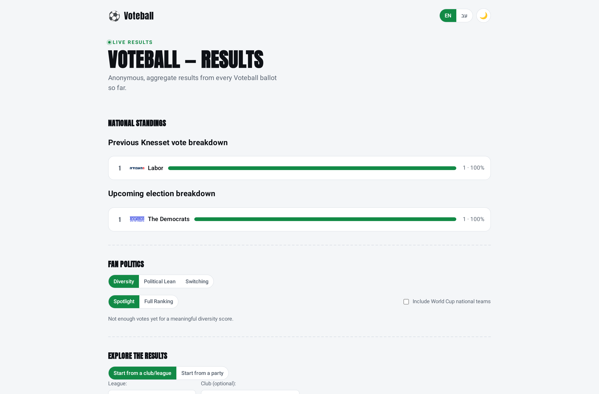
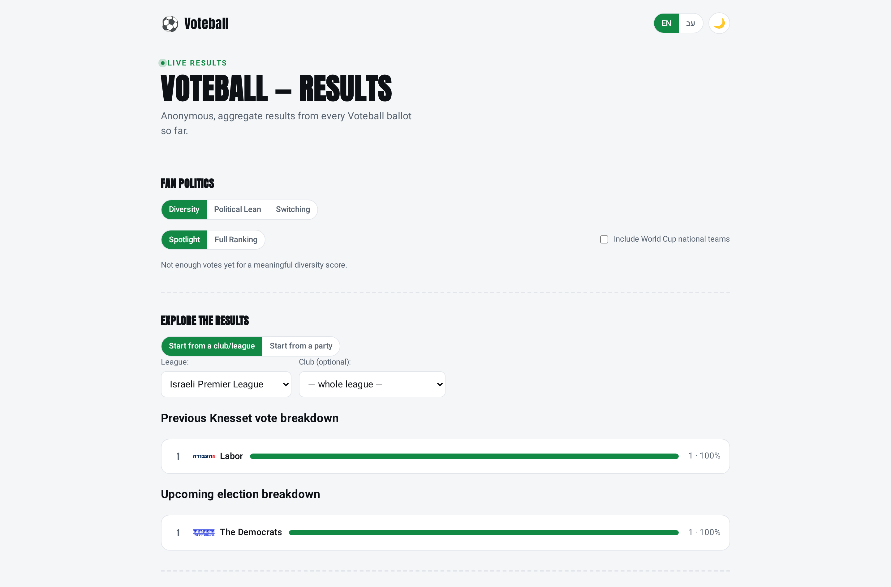

# CI/CD pipeline

How a code change becomes a running pod, with no manual deploy step.

Everything below was verified end-to-end on 2026-07-20 against the live cluster; the timings are from
that run.

---

## The short version

```
git push (services/**)  →  GitHub Actions  →  ECR  →  values.yaml bump  →  ArgoCD  →  pods roll
        you                    ~2m15s                     commit           ~45s        ~30s
```

Total: **about 4 minutes from `git push` to the change being live.** Nobody runs `kubectl` or `helm`.

---

## The pipeline, step by step

### 1. Trigger — `.github/workflows/ci.yml`

```yaml
on:
  push:
    branches: [master]
    paths:
      - "services/**"
      - ".github/workflows/ci.yml"
```

Only app-source changes rebuild images. Editing `README.md`, `terraform/` or `docs/` does **not** run
the pipeline.

> **Non-obvious:** the filter is a path match, not a "was this app code?" judgement. A docs-only commit
> that also touches `services/backend/schema.sql` (e.g. fixing a comment) *will* trigger a full build.
> That is correct — the file is baked into the backend image — but it surprises people.

### 2. Authenticate to AWS — OIDC, no stored keys

GitHub federates to `${cluster_name}-github-actions` via an OIDC provider, both created by Terraform.
There are **no AWS access keys in GitHub** — only `AWS_ROLE_ARN`, which is not a secret. The role's
trust policy is scoped to this repo on `master`.

### 3. Build, scan, push

Four images (`backend`, `worker`, `nginx`, `backup`) are built and tagged with the **short git SHA** —
never `latest`, so every deployed pod maps to an exact commit.

**Trivy blocks the pipeline** on `CRITICAL`/`HIGH` fixable vulnerabilities in the three app images. The
`backup` image is third-party (`postgres:17-alpine` + aws-cli) and is scanned **report-only**, since its
CVEs are upstream Go-tooling issues outside this project's control.

### 4. Bump the tag and commit back

```bash
sed -i -E "s/^  tag: \".*\"/  tag: \"${TAG}\"/" charts/voteball/values.yaml
git commit -m "ci: image tag ${TAG} [skip ci]" && git push
```

**`[skip ci]` is load-bearing.** Without it, CI's own commit would retrigger CI, forever.

### 5. ArgoCD syncs

The `voteball` Application watches `charts/voteball` on `master` with `automated: {prune, selfHeal}`.
It noticed the new tag and synced **45 seconds** after CI pushed, with no prompting, then Kubernetes
performed a rolling update across all three Deployments.

---

## Required GitHub repo variables

Settings → Secrets and variables → Actions → **Variables** (none of these are secrets):

| Variable | Value | Where it comes from |
|---|---|---|
| `AWS_ROLE_ARN` | `arn:aws:iam::<acct>:role/voteball-github-actions` | `terraform output github_actions_role_arn` |
| `AWS_REGION` | e.g. `il-central-1` | `aws_region` in your tfvars |
| `ECR_REGISTRY` | `<acct>.dkr.ecr.<region>.amazonaws.com` | `terraform output ecr_registry` |
| `CLUSTER_NAME` | `voteball` | `cluster_name` in your tfvars; defaults to `voteball` if unset |

If any of the first three is missing the run fails **immediately** — an empty region produces
`Input required and not supplied: aws-region`, and an empty registry produces invalid image
references like `/voteball-backend:abc1234`.

---

## Failure modes seen in practice

| Symptom | Cause | Fix |
|---|---|---|
| `Input required and not supplied: aws-region` | `AWS_REGION` / `ECR_REGISTRY` repo variables not set | Set them (table above) |
| `Could not assume role with OIDC: token could not be validated` | **The stack is destroyed** — the IAM role and OIDC provider are Terraform-managed, so they don't exist | Expected while torn down. Deploy first, or ignore the failed run |
| CI is green but the site doesn't change | No cluster, or no ArgoCD Application | `kubectl get application voteball -n argocd`; `./scripts/deploy.sh` bootstraps it |
| Pods go to `ImagePullBackOff` after a sync | `values.yaml` on `master` names a tag/registry that doesn't exist in this account's ECR | `./scripts/sync-values-from-tf.sh --check` |
| CI retriggers itself in a loop | `[skip ci]` missing from the bump commit | Restore it in `ci.yml` |

**The most important one is the second row:** CI cannot authenticate to AWS while the infrastructure is
destroyed. Any push during a teardown window fails at the OIDC step. That is arguably correct — there is
nothing to deploy to — but the failure email looks alarming and the cause is not obvious from the log.

---

## Doing it by hand

`./scripts/deploy.sh` runs the same work locally (build → push → sync values → helm → bootstrap
ArgoCD). Useful for the first deploy of a fresh cluster, when there is no ArgoCD yet for CI's commit to
reach.

Note the ordering constraint it encodes: **`values.yaml` must be committed and pushed before the ArgoCD
Application is created.** Bootstrapping ArgoCD against a `master` that still holds stale values makes it
immediately revert the deploy — after a rebuild, to an image tag that no longer exists, so every pod
lands in `ImagePullBackOff`.

---

## Verified run (2026-07-20)

A one-line UI change pushed as `57ef4dd`:

| Stage | Result |
|---|---|
| Workflow triggered | ✅ on the `services/**` filter |
| OIDC auth | ✅ |
| 4 images built + Trivy blocking scan | ✅ 2m15s |
| Pushed to ECR, bumped tag | ✅ `3efae90 ci: image tag 57ef4dd [skip ci]` |
| ArgoCD synced unprompted | ✅ 45s |
| Rolling update, no downtime | ✅ 0 `ImagePullBackOff` |

The deployed page before and after — same URL, the only human action being `git push`:

| Before | After |
|---|---|
|  |  |

Measured from the live DOM rather than eyeballed:

| | Before | After |
|---|---|---|
| National standings position | 2nd section | **4th (last)** |
| `#party-mode` computed `display` | `flex` (bug: both panels shown) | **`none`** |
