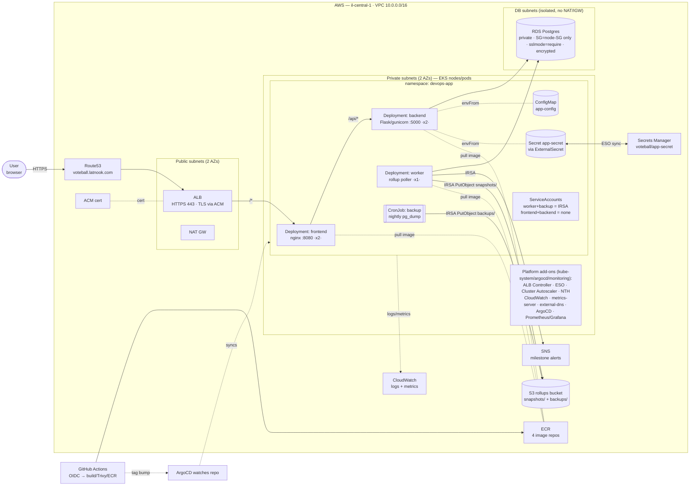

# Architecture

Voteball on EKS. Solid arrows = request/data flow; the AWS services on the right are reached from the
cluster. Only the frontend is internet-facing; backend/worker/DB are private.

## Zones & exposure
- **Internet-facing:** only the ALB (public subnets) → frontend. HTTP is redirected to HTTPS.
- **Private:** all pods + RDS are in private/DB subnets. Backend/worker/DB have no public entry;
  NetworkPolicies further restrict pod-to-pod (backend reachable only from frontend).
- **Egress:** pods reach AWS APIs (SNS/S3/Secrets Manager) and pull nothing untrusted; RDS is reached
  directly in-VPC.

## What builds what
- **Terraform (`terraform-eks/`):** the VPC, EKS cluster + node group, RDS, ECR, ACM, S3, SNS, Secrets
  Manager (container only), IRSA roles, and every platform add-on.
- **Helm chart (`charts/voteball`), delivered by ArgoCD:** everything in the `devops-app` box.
- **GitHub Actions:** builds/scans/pushes images and bumps the chart's image tag; ArgoCD syncs it.
