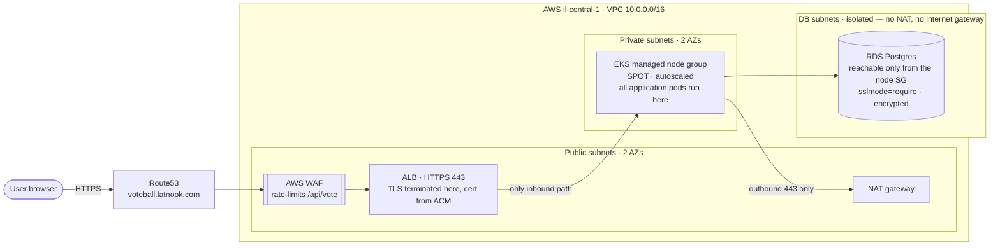
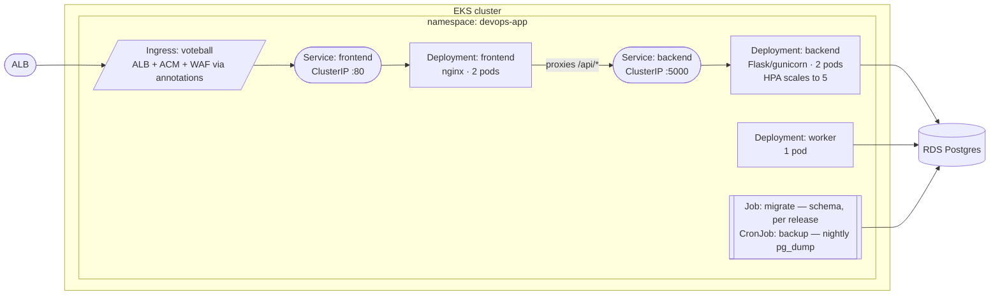
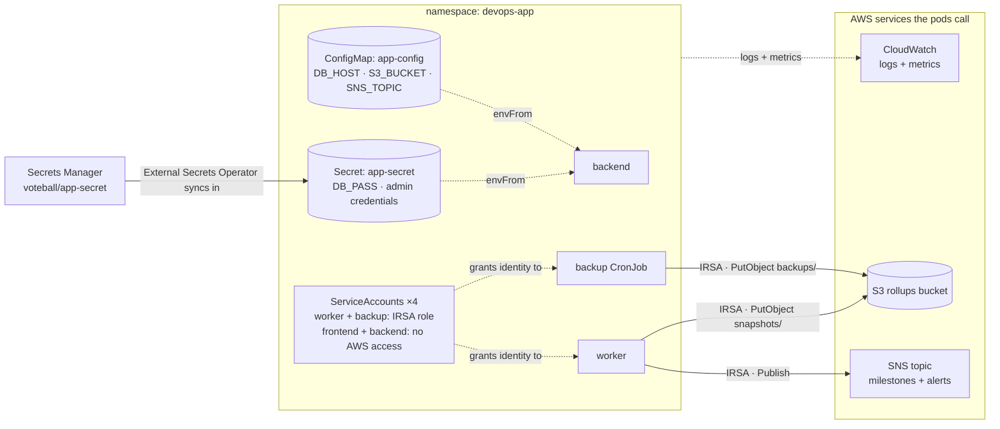
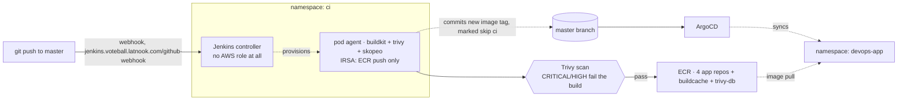
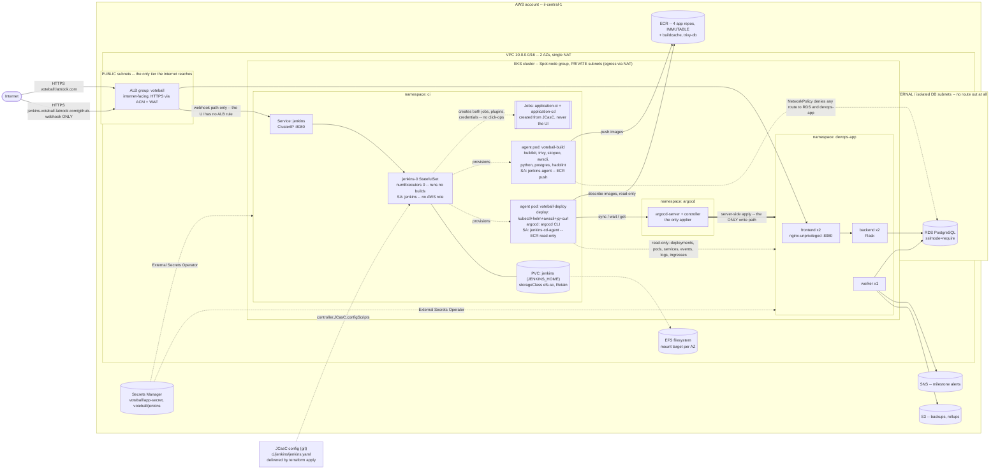

# Architecture

Voteball on EKS, in four views. Each answers one question; together they cover the whole system.
One large combined diagram was tried first and was unreadable — this is the same content, split.

**Arrow conventions (all four diagrams):**

| Arrow | Meaning |
|---|---|
| `──▶` solid | request / data flow, one direction |
| `╌╌▶` dashed | configuration, identity or control — not request traffic |
| `◀──▶` double | genuinely bidirectional |

Only the ALB is internet-facing. Backend, worker and the database are private.

---

## 1. Network and exposure — where things sit, and what the internet can touch

```mermaid
flowchart LR
    user([User browser])
    r53[Route53<br/>voteball.latnook.com]

    subgraph vpc["AWS il-central-1 · VPC 10.0.0.0/16"]
        subgraph pub["Public subnets · 2 AZs"]
            waf[[AWS WAF<br/>rate-limits /api/vote]]
            alb[ALB · HTTPS 443<br/>TLS terminated here, cert from ACM]
            nat[NAT gateway]
        end

        subgraph priv["Private subnets · 2 AZs"]
            nodes[EKS managed node group<br/>SPOT · autoscaled<br/>all application pods run here]
        end

        subgraph dbsub["DB subnets · isolated — no NAT, no internet gateway"]
            rds[(RDS Postgres<br/>reachable only from the node SG<br/>sslmode=require · encrypted)]
        end
    end

    user -->|HTTPS| r53 --> waf --> alb
    alb -->|only inbound path| nodes
    nodes --> rds
    nodes -->|outbound 443 only| nat
```

- **Internet-facing:** the ALB alone. HTTP is redirected to HTTPS; WAF sits in front of it.
- **Private:** every pod. Reachable only via the ALB, and only the frontend is a target.
- **Isolated:** RDS. No route in from the internet and no route out — not even through the NAT.

**There is one ALB, shared by two Ingresses.** `devops-app/voteball` (the site) and
`ci/jenkins-webhook` (the CI webhook path only, diagram 4) both carry
`alb.ingress.kubernetes.io/group.name: voteball`, so the load balancer controller puts them behind a
single load balancer instead of billing for two. This matters at teardown: an ALB is de-provisioned
only when its group has **no** members left, so deleting one Ingress leaves it running and its ENIs
pinning the VPC — which is why `scripts/destroy.sh` deletes both. A grouped ALB is also named
`k8s-<group>-<hash>`, not `k8s-<namespace>-<ingress>-<hash>`, so any check filtering on the old shape
reports "ALB gone" while it is still there.

---

## 2. Inside the cluster — the Kubernetes objects

```mermaid
flowchart LR
    alb([ALB])

    subgraph eks["EKS cluster"]
        subgraph ns["namespace: devops-app"]
            ing[/Ingress: voteball<br/>ALB + ACM + WAF via annotations/]
            fesvc([Service: frontend<br/>ClusterIP :80])
            besvc([Service: backend<br/>ClusterIP :5000])
            fe[Deployment: frontend<br/>nginx · 2 pods]
            be[Deployment: backend<br/>Flask/gunicorn · 2 pods<br/>HPA scales to 5]
            wk[Deployment: worker<br/>1 pod]
            jobs[[Job: migrate — schema, per release<br/>CronJob: backup — nightly pg_dump]]
        end
    end

    rds[(RDS Postgres)]

    alb --> ing --> fesvc --> fe
    fe -->|proxies /api/*| besvc --> be --> rds
    wk --> rds
    jobs --> rds
```

Governance objects applying across the namespace, not drawn as nodes because they constrain rather
than carry traffic:

- **NetworkPolicy** — default-deny ingress and egress; the backend accepts traffic from the frontend
  only; only `backend`/`worker`/`backup`/`frontend`/`migrate` pods may reach RDS.
- **HPA** on the backend only (CPU 70%, 2→5 pods). The frontend serves static files and is not
  CPU-bound, so it stays at a fixed 2 replicas · **PDB** (`minAvailable: 1`) on both.
- **Startup, readiness and liveness probes** on all three Deployments. They are not three grades of
  the same check — the kubelet does something different with each failure, so they are sized
  separately (see "Health checking" below).

### Health checking

Probes are run by the **kubelet on the node**, never through the API server, so a probe verdict is a
local judgment that survives a control-plane blip. All three probe types share the same scheduling
fields and differ only in what failure *does*:

| Probe | On failure | Recovery |
|---|---|---|
| **readiness** | pod IP removed from the Service's EndpointSlice, and (via `target-type: ip`) deregistered from the ALB target group | automatic, as soon as it passes again — nothing is killed |
| **liveness** | container killed: `SIGTERM` → 30s grace → `SIGKILL` → restarted **in place** | restart only; the pod is never rescheduled, so a node-caused fault loops forever |
| **startup** | same kill as liveness | same, with `CrashLoopBackOff` backoff 10s→20s→40s→…→5min |

While a startup probe is pending, **liveness and readiness do not run at all** and the container is
NotReady. That is the whole reason it exists: `initialDelaySeconds` only delays a probe's *first*
check, so without a startup probe one number has to serve both a slow boot and a tight runtime hang
check. Once the startup probe passes once, it never runs again for that container.

| Deployment | startup (budget) | readiness | liveness |
|---|---|---|---|
| **frontend** | `GET /` :8080, 3s × 10 = **30s** | `GET /` :8080 / 10s | `tcpSocket` :8080 / 20s |
| **backend** | `GET /health` :5000, 5s × 12 = **60s** | `GET /health` :5000 / 10s | `tcpSocket` :5000 / 20s |
| **worker** | heartbeat `exec`, 5s × 18 = **90s** | heartbeat `exec` / 15s | heartbeat `exec` / 30s |

Four things about this table are decisions, not defaults:

- **The backend's budget is the largest because it does not serve immediately.**
  `gunicorn.conf.py`'s `on_starting` hook runs `db.init_db()` (schema + seed) in the master *before*
  binding :5000, so nothing answers until that completes — slowest against an RDS instance freshly
  restored from a snapshot.
- **Liveness is deliberately weaker than readiness** on frontend and backend: a `tcpSocket` check, not
  an HTTP one. Readiness going false removes one pod from rotation; liveness going false *kills* it.
  A liveness probe that depended on the database would turn a single RDS blip into a simultaneous
  crash loop across every replica.
- **The frontend probes `/`, never `/health`** — nginx proxies only `/api/*`, so `/health` 404s there.
- **The worker's real detection time is not its `periodSeconds`.** Its probe command tests whether
  `/tmp/heartbeat` is *less than 120s old*, so the probe cannot begin failing until the heartbeat is
  already 120s stale. Time from "loop wedges" to "container killed" is ~120s + 3 × 30s ≈ **3.5 min**.
  That threshold lives inside the `test` expression, not in the probe schedule. Its probes also set
  `timeoutSeconds: 3` rather than the default 1, because each forks `sh` + `date` + `stat` and an
  exec probe that times out counts as a **failure** — at the default a CPU-throttled Spot node could
  kill a healthy worker for being slow to fork.

**A bad rollout stalls rather than breaking the site.** With `maxSurge: 25%` / `maxUnavailable: 25%`
on 2 replicas, Kubernetes rounds surge up (1) and unavailable down (**0**): a replacement that never
passes its probes leaves both old pods serving. After `progressDeadlineSeconds: 600` the Deployment
is marked `ProgressDeadlineExceeded` — Kubernetes does **not** roll back on its own, and neither does
ArgoCD (a crashlooping pod already matches git, so `selfHeal` has nothing to correct). Automatic
rollback comes from `Jenkinsfile-cd`, which runs only when `Jenkinsfile-ci` actually built — i.e. a
changeset touching `services/**` (or `FORCE_BUILD`, or the empty-changelog case G3b builds
defensively). A chart-only commit is skipped by G3 and syncs straight through ArgoCD **with no
rollback net**: probe, resource and manifest changes are exactly the class of edit that reaches
production without one. The alerts in `prometheusrule.yaml` are
what close that loop — `VoteballDeploymentDegraded` fires at 10m on exactly this state.

---

## 3. Configuration, identity and the AWS services

```mermaid
flowchart LR
    subgraph ns["namespace: devops-app"]
        cfg[(ConfigMap: app-config<br/>DB_HOST · S3_BUCKET · SNS_TOPIC)]
        sec[(Secret: app-secret<br/>DB_PASS · admin credentials)]
        sas[ServiceAccounts ×4<br/>worker + backup: IRSA role<br/>frontend + backend: no AWS access]
        be[backend]
        wk[worker]
        cron[backup CronJob]
    end

    sm[Secrets Manager<br/>voteball/app-secret]

    subgraph aws["AWS services the pods call"]
        sns[SNS topic<br/>milestones + alerts]
        s3[(S3 rollups bucket)]
        cw[CloudWatch<br/>logs + metrics]
    end

    sm -->|External Secrets Operator syncs in| sec
    cfg -.->|envFrom| be
    sec -.->|envFrom| be
    sas -.->|grants identity to| wk
    sas -.->|grants identity to| cron
    wk -->|IRSA · Publish| sns
    wk -->|IRSA · PutObject snapshots/| s3
    cron -->|IRSA · PutObject backups/| s3
    ns -.->|logs + metrics| cw
```

**The secret flow is one-way:** ESO reads Secrets Manager and writes the in-cluster Secret. Nothing in
the cluster writes back. Terraform creates only the empty container in Secrets Manager, so no secret
value ever enters git or the Terraform state.

**Least privilege is visible here:** the two ServiceAccounts that carry an AWS role can do exactly one
thing each. The frontend and backend carry no role at all. The worker's S3 permission is `PutObject`
only — it cannot read back what it wrote, which is why it tracks "did the results change?" in memory.

---

## 4. How code reaches the cluster

```mermaid
flowchart LR
    push[git push to master] -->|webhook, jenkins.voteball.latnook.com/github-webhook| jenkins

    subgraph ci["namespace: ci"]
        jenkins[Jenkins controller<br/>no AWS role at all]
        agent[pod agent · buildkit + trivy + skopeo<br/>IRSA: ECR push only]
        jenkins -.->|provisions| agent
    end

    agent --> trivy{{Trivy scan<br/>CRITICAL/HIGH fail the build}}
    trivy -->|pass| ecr[ECR · 4 app repos + buildcache + trivy-db]
    agent -.->|commits new image tag, marked skip ci| master[(master branch)]
    master --> argocd[ArgoCD] -.->|syncs| ns[namespace: devops-app]
    ecr -.->|image pull| ns
```

**Jenkins never touches the rest of the cluster and holds no cluster-deploy credentials** — its
controller carries no AWS role at all, and its namespace-scoped Role only lets it manage its own agent
pods in `ci`. It pushes images and commits a tag; ArgoCD does every deployment. The only thing that can
change production is a commit on `master`. **`ci` is a second namespace alongside `devops-app`**, kept
separate so the graded application namespace contains only the application, and so a NetworkPolicy in
`ci` can enforceably deny CI any route to RDS or `devops-app` rather than merely convention.

---

## 5. Pipeline Flow — commit to running site

Required by *משימה 4* §7 ("Pipeline Flow: הסדר הלוגי: commit, CI, tests, image build, registry, CD,
rollout, smoke test ו-rollback"). Stage names and order below are read directly from `Jenkinsfile-ci`
and `Jenkinsfile-cd`, not summarized from memory — grep them yourself with
`grep -n "stage('" Jenkinsfile-ci Jenkinsfile-cd` if this drifts again.

```mermaid
flowchart TD
    dev["Developer pushes to master"] --> gh["GitHub"]
    gh -->|"webhook -> https://jenkins.voteball.latnook.com/github-webhook"| guard

    subgraph ci["application-ci  (agent: voteball-build, SA: jenkins-agent -- ECR push)"]
        guard{"Guard: is this our<br/>own commit? [skip ci]"}
        guard -->|"yes"| stop(["NOT_BUILT -- loop broken"])
        guard -->|"no"| validate["Validation<br/>repo-shape checks"]
        validate --> scripttests["Script tests<br/>run-ci-suite.sh -- the pipeline's own guards<br/>run TWICE: jnlp (git) + python container"]
        scripttests --> lint["Lint / Static Analysis<br/>ruff + hadolint"]
        lint --> tests["Tests<br/>280 pytest (233 backend + 47 worker)<br/>Postgres sidecar"]
        tests --> resolve["Resolve tag and account"]
        resolve --> built{"Already built?<br/>tag in ECR?"}
        built -->|"no"| build["Build images<br/>rootless BuildKit x4"]
        build --> scan["Trivy scan<br/>fail on HIGH/CRITICAL<br/>backup image: report only"]
        scan --> push["Push to ECR<br/>skopeo, tag = commit SHA"]
        built -->|"yes"| meta
        push --> meta["Publish Metadata<br/>image-metadata.json + digest"]
        meta --> trigger["Trigger CD<br/>build application-cd, wait:false"]
    end

    tests -.->|"any test fails"| failci(["FAILED -- nothing built, nothing deployed"])
    scan -.->|"HIGH/CRITICAL"| failci

    trigger -->|"IMAGE_TAG, IMAGE_DIGEST, SOURCE_BUILD"| checkout

    subgraph cd["application-cd  (agent: voteball-deploy, SA: jenkins-cd-agent -- ECR READ-ONLY)"]
        checkout["Checkout<br/>records tag, source CI build, digest"]
        checkout --> inval["Input Validation<br/>not latest, is a SHA, images in ECR, NAMESPACE allowlisted"]
        inval --> manval["Manifest Validation<br/>helm lint + helm template<br/>+ kubectl CREATE --dry-run=client<br/>(not apply: apply reads live objects)"]
        manval --> promote["Promote<br/>write image.tag, commit skip ci, push"]
        promote --> sync["Deploy<br/>argocd app sync --revision"]
        sync --> wait["Rollout<br/>argocd app wait --sync --health"]
        wait --> verify["Verify<br/>argocd app get: Synced + Healthy + revision"]
        verify --> smoke["Smoke Test<br/>HTTPS GET / + /api/options<br/>+ /api/results?by=all<br/>(NOT /health -- 404 from outside)"]
        smoke -->|"pass"| done(["Deployed and verified"])
        smoke -.->|"fail"| rb
        wait -.->|"timeout"| rb
        verify -.->|"degraded"| rb
        rb{"Rollback -- is this build<br/>ITSELF already a rollback?<br/>ROLLBACK_DEPTH >= 1"}
        rb -->|"yes: stop -- production<br/>left running, needs a human"| stophuman(["NO ROLLBACK -- needs a human"])
        rb -->|"no"| rbtarget{"rollback-target.sh:<br/>is the previous tag<br/>STILL IN ECR?"}
        rbtarget -->|"yes: re-run CD on the<br/>previous tag, depth + 1"| promote
        rbtarget -->|"no -- the rebuild deleted it<br/>(git remembers, ECR does not)"| stophuman
    end

    promote -->|"commit to master"| argo
    sync -.->|"sync request"| argo
    argo["ArgoCD<br/>the only thing that applies to the cluster"] -->|"server-side apply"| k8s["devops-app<br/>frontend / backend / worker"]
```

**Reading it:** everything inside `application-cd` is a *request* or a *read* — `argocd app sync` /
`app wait` / `app get`, never `kubectl apply` or `kubectl rollout`. The only arrow that writes to the
cluster comes from ArgoCD, because Jenkins holds no permission to apply anything — see
`charts/jenkins-support/templates/rbac.yaml`. **Rollback is bounded, not an unbounded retry loop:** a
failed deploy re-runs `application-cd` against the previous tag exactly once (`ROLLBACK_DEPTH`
incremented); if that rollback *also* fails verification, the pipeline stops and leaves production on
whatever is currently running rather than oscillating between two tags forever — see the `post >
failure` block in `Jenkinsfile-cd` for the reproduced b/c/b/c cycle this bound closes.

---

## 6. Deployment View — what runs where

Required by *משימה 4* §7 ("Deployment View: היכן Jenkins והאפליקציה רצים: clusters, namespaces, Pods,
Services, storage ו-network boundaries").

```mermaid
flowchart LR
    internet(["Internet"])

    subgraph aws["AWS account -- il-central-1"]
        subgraph vpc["VPC 10.0.0.0/16 -- 2 AZs, single NAT"]
            subgraph pub["PUBLIC subnets -- the only tier the internet reaches"]
                alb["ALB group: voteball<br/>internet-facing, HTTPS via ACM + WAF"]
            end

            subgraph eks["EKS cluster -- Spot node group, PRIVATE subnets (egress via NAT)"]
                subgraph nsci["namespace: ci"]
                    svc["Service: jenkins<br/>ClusterIP :8080"]
                    jc["jenkins-0 StatefulSet<br/>numExecutors 0 -- runs no builds<br/>SA: jenkins -- no AWS role"]
                    jobs[["Jobs: application-ci + application-cd<br/>created from JCasC, never the UI"]]
                    pvc[("PVC: jenkins (JENKINS_HOME)<br/>storageClass efs-sc, Retain")]
                    ab["agent pod: voteball-build<br/>buildkit, trivy, skopeo, awscli,<br/>python, postgres, hadolint<br/>SA: jenkins-agent -- ECR push"]
                    ad["agent pod: voteball-deploy<br/>deploy: kubectl+helm+awscli+jq+curl<br/>argocd: argocd CLI<br/>SA: jenkins-cd-agent -- ECR read-only"]
                end

                subgraph nsargo["namespace: argocd"]
                    ac["argocd-server + controller<br/>the only applier"]
                end

                subgraph nsapp["namespace: devops-app"]
                    fe["frontend x2<br/>nginx-unprivileged :8080"]
                    be["backend x2<br/>Flask"]
                    wk["worker x1"]
                end
            end

            subgraph iso["INTERNAL / isolated DB subnets -- no route out at all"]
                rds[("RDS PostgreSQL<br/>sslmode=require")]
            end

            efs[("EFS filesystem<br/>mount target per AZ")]
        end

        ecr[("ECR -- 4 app repos, IMMUTABLE<br/>+ buildcache, trivy-db")]
        sm[("Secrets Manager<br/>voteball/app-secret, voteball/jenkins")]
        s3[("S3 -- backups, rollups")]
        sns[("SNS -- milestone alerts")]
    end

    jcasc["JCasC config (git)<br/>ci/jenkins/jenkins.yaml<br/>delivered by terraform apply"]

    internet -->|"HTTPS voteball.latnook.com"| alb
    internet -->|"HTTPS jenkins.voteball.latnook.com/github-webhook ONLY"| alb
    alb --> fe
    alb -->|"webhook path only -- the UI has no ALB rule"| svc --> jc

    jcasc -.->|"controller.JCasC.configScripts"| jc
    jc -.->|"creates both jobs, plugins,<br/>credentials -- no click-ops"| jobs
    jc -.->|"provisions"| ab
    jc -.->|"provisions"| ad
    jc --- pvc
    pvc -.-> efs

    ab -->|"push images"| ecr
    ad -->|"describe images, read-only"| ecr
    ad -->|"sync / wait / get"| ac
    ad -.->|"read-only: deployments, pods, services, events, logs, ingresses"| nsapp
    ac ==>|"server-side apply -- the ONLY write path"| nsapp

    fe --> be
    be --> rds
    wk --> rds
    wk --> sns
    wk --> s3

    sm -.->|"External Secrets Operator"| nsci
    sm -.->|"External Secrets Operator"| nsapp

    ab -.->|"NetworkPolicy denies any route to RDS and devops-app"| rds
```

**Boundaries that matter:**

- **Only two paths from the internet exist**: the app on `voteball.latnook.com`, and exactly one path,
  `/github-webhook`, on `jenkins.voteball.latnook.com`. The Jenkins UI, script console and credential
  store have no ALB rule reaching them and are unreachable from outside the cluster; operators use
  `kubectl port-forward -n ci svc/jenkins 8080:8080`.
- **The `ci` namespace cannot reach RDS or `devops-app`** — its egress NetworkPolicy allows the
  internet but excludes the VPC's own CIDR ranges, so it is enforced structurally, not by convention.
- **The double arrow is the only write into `devops-app`.** Jenkins' CD agent (`jenkins-cd-agent`)
  holds a strictly read-only Role in `devops-app` — `get`/`list`/`watch` on deployments, replicasets,
  pods, services, events, ingresses, plus `get` on pod logs, and nothing else; every change is applied
  by ArgoCD.
- **The controller carries no AWS role at all.** Only the two agent ServiceAccounts do:
  `jenkins-agent` can push to ECR, `jenkins-cd-agent` can only read it.
- **Both jobs, all plugins and every credential come from `ci/jenkins/jenkins.yaml` (JCasC), applied
  by `controller.JCasC.configScripts` at every controller boot** — there is no UI job-creation step
  and nothing configured by clicking survives the next restart. Terraform delivers the file into the
  Helm release; a change only reaches the running controller via `terraform apply`, never by
  committing to `master`.
- **`JENKINS_HOME` is a PersistentVolumeClaim on EFS, not an `emptyDir`.** EFS has a mount target in
  every AZ, so a rescheduled controller pod is never stuck waiting for a volume to follow it back to
  one AZ the way an EBS-backed PVC would be — see `terraform/addon-efs.tf`. The storage class reclaim
  policy is `Retain`, but that protects the *data*, not build history end-to-end: the PVC carries no
  `helm.sh/resource-policy: keep` annotation (there is none anywhere in this repo), so a
  `helm uninstall` — or the targeted `terraform destroy -target=helm_release.jenkins` that
  `scripts/jenkins/uninstall-jenkins.sh` runs — still deletes the PVC and releases the PV. The EFS
  filesystem and its data are not deleted, but a reinstall provisions a brand-new dynamic access point
  rather than rebinding the released one, so build history does not come back on its own; recovering
  it needs a manual PV rebind, or pointing a new PVC at the old access point (same script documents
  the exact steps). Configuration is unaffected either way — JCasC rebuilds the controller from git on
  every boot regardless of what the volume holds.

---

## What builds what

- **Terraform (`terraform/`):** the VPC, EKS cluster + node group, RDS (7-day PITR), ECR, ACM, WAF, S3,
  SNS, Secrets Manager (container only), IRSA roles, and every platform add-on — AWS Load Balancer
  Controller, External Secrets Operator, Cluster Autoscaler, Node Termination Handler, CloudWatch
  pod logging, metrics-server, external-dns, ArgoCD, kube-prometheus-stack, **and Jenkins**
  (`terraform/addon-jenkins.tf`). State lives in a versioned, locked S3 bucket owned by no stack.
- **Helm chart (`charts/voteball`), delivered by ArgoCD:** everything in the `devops-app` box —
  diagrams 2 and 3.
- **Jenkins (namespace `ci`):** builds, scans and pushes the four images, then commits the new image tag
  to `charts/voteball/values.yaml`. It is a **platform add-on, installed by `terraform apply` like the
  rest of this list — not by ArgoCD, and not by committing to `master`.** Its controller is still
  deliberately disposable — every setting rebuilds from JCasC (`ci/jenkins/jenkins.yaml`) on every
  boot, never from the UI — but `JENKINS_HOME` is a PersistentVolumeClaim on EFS (`efs-sc`, `Retain`;
  diagram 6), not an `emptyDir`, so a Spot reclaim of the controller pod — the routine case — no
  longer loses build history; the same PVC rebinds. Removing the release itself (`helm uninstall`, or
  `scripts/jenkins/uninstall-jenkins.sh`'s targeted `terraform destroy`) still does: the PVC has no
  `resource-policy: keep`, so it is deleted, and a reinstall provisions a new EFS access point rather
  than rebinding the old one — see that script for the manual recovery steps. Only a full
  `terraform destroy` of the EFS resources deletes the underlying data itself, for good. Credentials
  still live in Secrets Manager, never on the volume. See [`docs/cicd.md`](../cicd.md).
