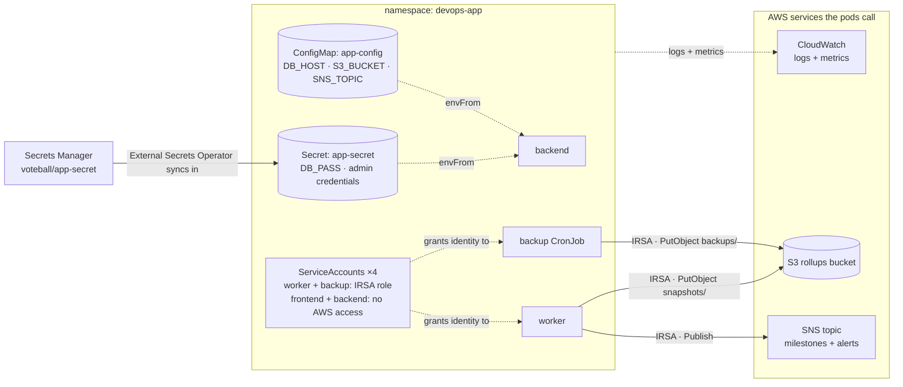
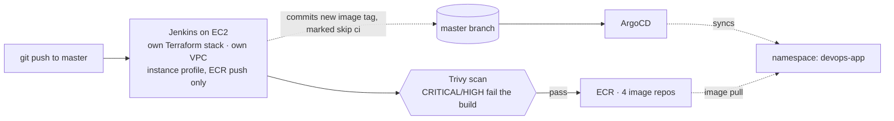

# Architecture

Voteball on EKS, in four views. Each answers one question; together they cover the whole system.
One large combined diagram was tried first and was unreadable — this is the same content, split.

**Arrow conventions (all four diagrams):**

| Arrow | Meaning |
|---|---|
| `──▶` solid | request / data flow, one direction |
| `╌╌▶` dashed | configuration, identity or control — not request traffic |
| `◀──▶` double | genuinely bidirectional |

Only the ALB is internet-facing. Backend, worker and the database are private.

---

## 1. Network and exposure — where things sit, and what the internet can touch

```mermaid
flowchart LR
    user([User browser])
    r53[Route53<br/>voteball.latnook.com]

    subgraph vpc["AWS il-central-1 · VPC 10.0.0.0/16"]
        subgraph pub["Public subnets · 2 AZs"]
            waf[[AWS WAF<br/>rate-limits /api/vote]]
            alb[ALB · HTTPS 443<br/>TLS terminated here, cert from ACM]
            nat[NAT gateway]
        end

        subgraph priv["Private subnets · 2 AZs"]
            nodes[EKS managed node group<br/>SPOT · autoscaled<br/>all application pods run here]
        end

        subgraph dbsub["DB subnets · isolated — no NAT, no internet gateway"]
            rds[(RDS Postgres<br/>reachable only from the node SG<br/>sslmode=require · encrypted)]
        end
    end

    user -->|HTTPS| r53 --> waf --> alb
    alb -->|only inbound path| nodes
    nodes --> rds
    nodes -->|outbound 443 only| nat
```

- **Internet-facing:** the ALB alone. HTTP is redirected to HTTPS; WAF sits in front of it.
- **Private:** every pod. Reachable only via the ALB, and only the frontend is a target.
- **Isolated:** RDS. No route in from the internet and no route out — not even through the NAT.

---

## 2. Inside the cluster — the Kubernetes objects

```mermaid
flowchart LR
    alb([ALB])

    subgraph eks["EKS cluster"]
        subgraph ns["namespace: devops-app"]
            ing[/Ingress: voteball<br/>ALB + ACM + WAF via annotations/]
            fesvc([Service: frontend<br/>ClusterIP :80])
            besvc([Service: backend<br/>ClusterIP :5000])
            fe[Deployment: frontend<br/>nginx · 2 pods]
            be[Deployment: backend<br/>Flask/gunicorn · 2 pods<br/>HPA scales to 5]
            wk[Deployment: worker<br/>1 pod]
            jobs[[Job: migrate — schema, per release<br/>CronJob: backup — nightly pg_dump]]
        end
    end

    rds[(RDS Postgres)]

    alb --> ing --> fesvc --> fe
    fe -->|proxies /api/*| besvc --> be --> rds
    wk --> rds
    jobs --> rds
```

Governance objects applying across the namespace, not drawn as nodes because they constrain rather
than carry traffic:

- **NetworkPolicy** — default-deny ingress and egress; the backend accepts traffic from the frontend
  only; only `backend`/`worker`/`backup`/`frontend`/`migrate` pods may reach RDS.
- **HPA** on the backend only (CPU 70%, 2→5 pods). The frontend serves static files and is not
  CPU-bound, so it stays at a fixed 2 replicas · **PDB** (`minAvailable: 1`) on both.

---

## 3. Configuration, identity and the AWS services

```mermaid
flowchart LR
    subgraph ns["namespace: devops-app"]
        cfg[(ConfigMap: app-config<br/>DB_HOST · S3_BUCKET · SNS_TOPIC)]
        sec[(Secret: app-secret<br/>DB_PASS · admin credentials)]
        sas[ServiceAccounts ×4<br/>worker + backup: IRSA role<br/>frontend + backend: no AWS access]
        be[backend]
        wk[worker]
        cron[backup CronJob]
    end

    sm[Secrets Manager<br/>voteball/app-secret]

    subgraph aws["AWS services the pods call"]
        sns[SNS topic<br/>milestones + alerts]
        s3[(S3 rollups bucket)]
        cw[CloudWatch<br/>logs + metrics]
    end

    sm -->|External Secrets Operator syncs in| sec
    cfg -.->|envFrom| be
    sec -.->|envFrom| be
    sas -.->|grants identity to| wk
    sas -.->|grants identity to| cron
    wk -->|IRSA · Publish| sns
    wk -->|IRSA · PutObject snapshots/| s3
    cron -->|IRSA · PutObject backups/| s3
    ns -.->|logs + metrics| cw
```

**The secret flow is one-way:** ESO reads Secrets Manager and writes the in-cluster Secret. Nothing in
the cluster writes back. Terraform creates only the empty container in Secrets Manager, so no secret
value ever enters git or the Terraform state.

**Least privilege is visible here:** the two ServiceAccounts that carry an AWS role can do exactly one
thing each. The frontend and backend carry no role at all. The worker's S3 permission is `PutObject`
only — it cannot read back what it wrote, which is why it tracks "did the results change?" in memory.

---

## 4. How code reaches the cluster

```mermaid
flowchart LR
    push[git push to master] --> jenkins[Jenkins on EC2<br/>own Terraform stack · own VPC<br/>instance profile, ECR push only]
    jenkins --> trivy{{Trivy scan<br/>CRITICAL/HIGH fail the build}}
    trivy -->|pass| ecr[ECR · 4 image repos]
    jenkins -.->|commits new image tag, marked skip ci| master[(master branch)]
    master --> argocd[ArgoCD] -.->|syncs| ns[namespace: devops-app]
    ecr -.->|image pull| ns
```

**Jenkins never touches the cluster** and holds no cluster credentials. It pushes images and commits a
tag; ArgoCD does every deployment. The only thing that can change production is a commit on `master`.

---

## What builds what

- **Terraform (`terraform/`):** the VPC, EKS cluster + node group, RDS (7-day PITR), ECR, ACM, WAF, S3,
  SNS, Secrets Manager (container only), IRSA roles, and every platform add-on — AWS Load Balancer
  Controller, External Secrets Operator, Cluster Autoscaler, Node Termination Handler, CloudWatch
  Container Insights, metrics-server, external-dns, ArgoCD, kube-prometheus-stack. State lives in a
  versioned, locked S3 bucket owned by no stack.
- **Helm chart (`charts/voteball`), delivered by ArgoCD:** everything in the `devops-app` box —
  diagrams 2 and 3.
- **Jenkins (`terraform/jenkins/`):** builds, scans and pushes the four images, then commits the new
  image tag to `charts/voteball/values.yaml`. It runs on its own EC2 host in its **own Terraform stack
  and the default VPC**, so tearing the application stack down does not delete the CI server. See
  [`docs/cicd.md`](../cicd.md).
